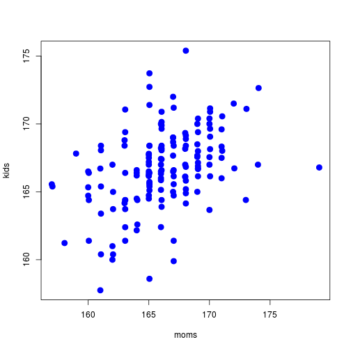
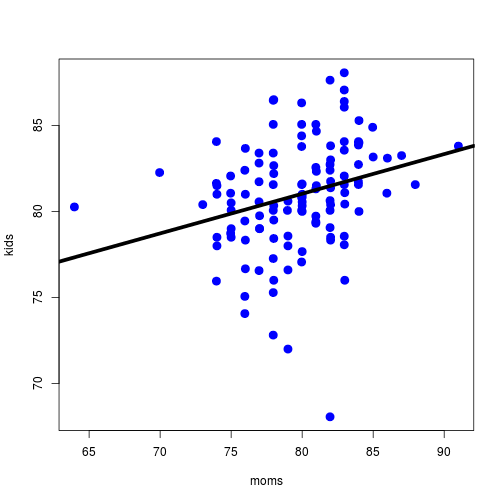
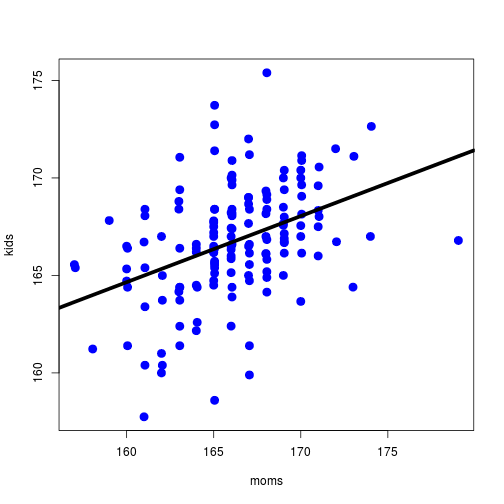
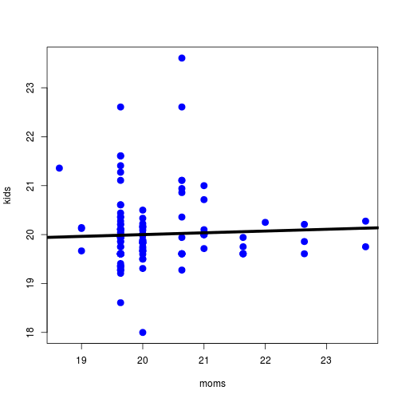

# Heritability of snake vertebral numbers
2011 Josef C Uyeda & Stevan J Arnold

(revised Jan 2012)

## Stage 1: Get data into R and estimate heritability by regression
Get your data into R by following the following steps
Save the file R_inland_snake_data.txt to your desktop or folder of choice
Now, set your working directory by
putting your windows username or specifying the folder you created in the following 	statement.
Be sure and use the / not the \ spacing convention!

Set your working directory

```r
# setwd('directory name here')
```


Now read in your data

```r
thamnophis = read.table("R_inland_snake_data.txt", header = TRUE)
```


Attach the data frame to the local environment

```r
attach(thamnophis)
```

```
## The following objects are masked from thamnophis (position 3):
## 
##     body, family, ilab, local, mid, post, slab, tail
## The following objects are masked from thamnophis (position 4):
## 
##     body, family, ilab, local, mid, post, slab, tail
## The following objects are masked from thamnophis (position 5):
## 
##     body, family, ilab, local, mid, post, slab, tail
## The following objects are masked from thamnophis (position 6):
## 
##     body, family, ilab, local, mid, post, slab, tail
## The following objects are masked from thamnophis (position 7):
## 
##     body, family, ilab, local, mid, post, slab, tail
## The following objects are masked from thamnophis (position 9):
## 
##     body, family, ilab, local, mid, post, slab, tail
## The following objects are masked from thamnophis (position 10):
## 
##     body, family, ilab, local, mid, post, slab, tail
```


Calculate the heritability of "body"
Create a vector of all the unique family codes

```r
family.list = unique(family)
family.list
```

```
##   [1]  420  437  438  440  494  497  507  511  512  515  516  522  534  540
##  [15]  541  543  545  549  550  554  556  591  676  686  687  693  697  698
##  [29]  703  704  711  712  713  720  724  729  737  895  896  905  911  916
##  [43]  918  920  924  929  934  939  940  947  976  986  987  998 1004 1005
##  [57] 1008 1011 1044 1045 1046 1047 1048 1052 1056 1058 1060 1169 1180 1185
##  [71] 1186 1200 1212 1227  160  249  259  260  265  267  268  274  277  278
##  [85]  279  283  352  355  358  369  370  371  374  375  376  377  379  385
##  [99]  386  452  470  474  482  485  486  904  906  908  917  921  922  923
## [113]  926  927  930  931  933  935  936  937  938  941  942  943  944  946
## [127]  948  949  950  951  954  981  999 1006 1010 1016 1018 1019 1022 1024
## [141] 1027 1054 1073 1080 1088 1090 1102 1144 1162 1166 1167 1178 1181 1182
## [155] 1195 1198 1199 1209 1210 1214 1215
```


We will now calculate the heritability of the body vertebrae. We will need to 
do two things, create a vector of all of the mom's vertebrae counts, and create
a vector of all the kid's vertebrae counts averaged over families. 

```r
moms = NULL
kids = NULL
```

Go through a loop with i equal to a each successive value in family.list; copy from ‘for’ to ‘}’ and paste in R console

```r
for (i in family.list) {
    byfam = subset(body, family == i)  #Create a vector of body vertebrae counts for family i
    moms = rbind(moms, byfam[1])  #Save the moms count as the next element in the vector 'moms'
    kids = rbind(kids, mean(byfam[-1], na.rm = TRUE))  #Save the mean of the kids count as the next element in the vector 'kids' (you are excluding the 1st element of the vector, which is the mom)
}
```

Linear regression of kids on moms, will save a bunch of stuff in ls; to see the summary statistics run "summary(ls)", we especially want the slope, which is stored in ls$coefficients

```r
ls = lm(kids ~ moms)
plot(moms, kids, col = "blue", pch = 19, cex = 1.5)
```

 


Extract the 2nd coefficient from the object "coefficients" in "ls"

```r
slope = ls$coefficients[2]
```


the heritability estimate is twice the slope because we are using just one parent, not both

```r
h.squared = 2 * slope
h.squared
```

```
##   moms 
## 0.6781
```

```r
abline(ls, lwd = 5)
```

```
## Error: plot.new has not been called yet
```

 
Calculate the heritability of "tail"

```r
# Create a vector of all the unique family codes
family.list = unique(family)
```

We will now calculate the heritability of the tail vertebrae. We will need to 
do two things, create a vector of all of the mom's vertebrae counts, and create
a vector of all the kid's vertebrae counts averaged over families. 

```r
moms = NULL
kids = NULL
```

Go through a loop with i equal to a each successive value in family.list 

```r
for (i in family.list) {
    byfam = subset(tail, family == i)  #Create a vector of tail vertebrae counts for family i
    moms = rbind(moms, byfam[1])  #Save the moms count as the next element in the vector 'moms'
    kids = rbind(kids, mean(byfam[-1], na.rm = TRUE))  #Save the mean of the kids count as the next element in the vector 'kids' (you are excluding the 1st element of the vector, which is the mom)
}
```


Linear regression of kids on moms, will save a bunch of stuff in ls; to see the summary statistics run "summary(ls)", we especially want the slope, which is stored in ls$coefficients

```r
ls = lm(kids ~ moms)
```

Extract the 2nd coefficient from the object "coefficients" in "ls"

```r
slope = ls$coefficients[2]
h.squared = 2 * slope
plot(moms, kids, col = "blue", pch = 19, cex = 1.5)
abline(ls, lwd = 5)
```

 


## Stage 2: Use bootstrapping to make an interval estimate of heritability
Make a function that can quickly calculate the heritability for each trait
In the user-defined function h2, V is the name of the trait whose heritability will be estimated

```r
h2 = function(V) {
    family.list = unique(family)
    moms = NULL
    kids = NULL
    for (i in family.list) {
        byfam = subset(V, family == i)
        moms = rbind(moms, byfam[1])
        kids = rbind(kids, mean(byfam[-1], na.rm = TRUE))
    }
    plot(moms, kids, col = "blue", pch = 19, cex = 1.5)
    ls = lm(kids ~ moms)
    abline(ls, lwd = 5)
    
    slope = ls$coeff[2]
    h.squared = 2 * slope
    h.squared
}
```


Test the new function called h2:

```r
h2(body)
```

 

```
##   moms 
## 0.6781
```

```r
h2(ilab)
```

 

```
##    moms 
## 0.07258
```

```r
h2(tail)
```

 

```
##   moms 
## 0.4611
```


Bootstrap the heritability of "body"

```r
family.list = unique(family)
h2.all = NULL
```

Set the "show.plots=TRUE" if you want to see the plot each generation (may not work with all graphics devices)

```r
show.plots = FALSE
```


Now loop over 1000 bootstrap iterations

```r
for (j in 1:1000) {
    moms = NULL
    kids = NULL
    family.list.boot = sample(family.list, replace = TRUE)
    for (i in family.list.boot) {
        byfam = subset(body, family == i)
        moms = rbind(moms, byfam[1])
        kids = rbind(kids, mean(byfam[-1], na.rm = TRUE))
    }
    
    ls = lm(kids ~ moms)
    slope = ls$coeff[2]
    h.squared = 2 * slope
    ## Save the heritability of replicate i as the ith element in vector h2.all
    h2.all = rbind(h2.all, h.squared)
    if (show.plots) {
        ## Graph showing the variation in points sampled
        plot(moms, kids, xlim = c(150, 180), ylim = c(150, 180))
        ## Superimpose on that graph the regression ls
        abline(ls$coefficients)
    }
}
```

Plot a histogram of the heritability estimates and corresponding summary stats 

```r
hist(h2.all, xlab = "Heritability")
mean(h2.all)
```

```
## [1] 0.6882
```

```r
abline(v = mean(h2.all), lty = 2)
```

 

```r
var(h2.all)  #Our estimate of the sampling variance of the mean
```

```
##         moms
## moms 0.01802
```

```r
sd(h2.all)  #Our estimate of the standard error of the mean
```

```
## [1] 0.1342
```


Create a program h2boot that calculates bootstrap values so we can get the value for 
each variable quickly; copy the following statements all the way thru the 3rd “}” and  
paste into console


```r
family.list = unique(family)
h2boot = function(V, boot.reps = 1000, show.plots = FALSE) {
    h2.all = NULL
    for (j in 1:boot.reps) {
        moms = NULL
        kids = NULL
        family.list.boot = sample(family.list, replace = TRUE)  #This is the key to bootstrapping
        for (i in family.list.boot) {
            byfam = subset(V, family == i)
            moms = rbind(moms, byfam[1])
            kids = rbind(kids, mean(byfam[-1], na.rm = TRUE))
        }
        
        ls = lm(kids ~ moms)
        slope = ls$coeff[2]
        h2 = 2 * slope
        ## Save the heritability of replicate i as the ith element in vector h2.all
        h2.all = rbind(h2.all, h2)
        if (show.plots) {
            plot(moms, kids, xlim = c(min(V, na.rm = TRUE), max(V, na.rm = TRUE)), 
                ylim = c(min(V, na.rm = T), max(V, na.rm = TRUE)))  #Graph showing the variation in points sampled
            ## Superimpose on that graph the regression ls
            abline(ls$coefficients)
        }
    }
    hist(h2.all, xlab = "Heritability")
    out <- list(mean = mean(h2.all), sd = sd(h2.all))
    return(out)
}
```


Use ‘h2boot(tail)’ to start the program on ‘tail’

